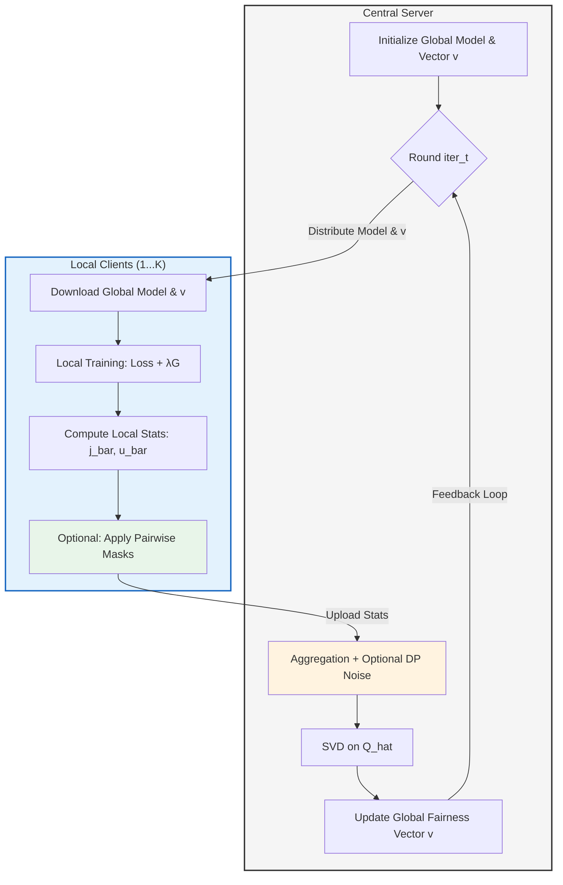

```mermaid
graph TD
    %% ================= SERVER =================
    subgraph Server ["Central Server"]
        S1[Initialize Global Model & Vector v]
        S2{Round iter_t}
        S3[Aggregation + Optional DP Noise]
        S4[SVD on Q_hat]
        S5[Update Global Fairness Vector v]
    end

    %% ================= CLIENTS =================
    subgraph Clients ["Local Clients (1...K)"]
        C1[Download Global Model & v]
        C2[Local Training: Loss + λG]
        C3[Compute Local Stats: j_bar, u_bar]
        C4[Optional: Apply Pairwise Masks]
    end

    %% ================= FLOW =================
    S1 --> S2
    S2 -->|Distribute Model & v| C1
    C1 --> C2
    C2 --> C3
    C3 --> C4
    C4 -->|Upload Stats| S3
    S3 --> S4
    S4 --> S5
    S5 -->|Feedback Loop| S2

    %% ================= STYLING =================
    style Server fill:#f5f5f5,stroke:#333,stroke-width:2px
    style Clients fill:#e3f2fd,stroke:#1565c0,stroke-width:2px
    style S3 fill:#fff3e0
    style C4 fill:#e8f5e9
```
