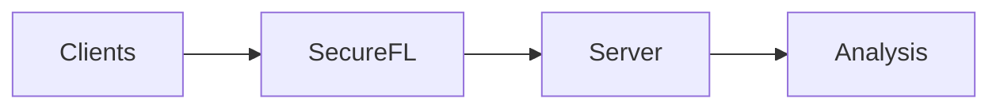
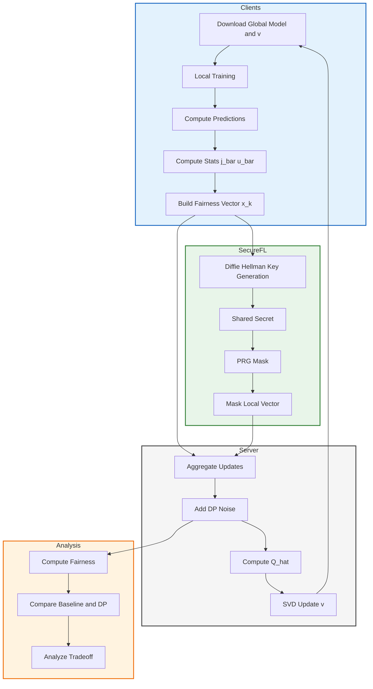

# Secure Federated Learning
This Work extends federated learning with fairness-aware optimization by integrating secure FL into the Rényi-based framework.

Clients train models locally and compute fairness-related statistics. These updates are protected through secure FL layer using key-sharing mechanisms, ensuring that individual client contributions remain hidden. The server then aggregates the masked updates, and updates a global fairness vector.

This design enables a unified analysis of privacy, security, and fairness tradeoffs in federated learning.


## Full Pipeline

<details>
<summary><b>Click to expand full system flow</b></summary>

<br>



</details>

## Key Idea

* Clients train locally without sharing raw data
* Secure aggregation hides individual updates
* Fairness without compromised is analyzed across clients

## Results and Analysis

This section presents the secure aggregation process, verification of correctness, and final performance metrics.

---

### Secure Aggregation: Client-Level Logs

Each client computes a local fairness vector:

* `x_k` → true local statistics
* `mask` → cryptographic noise (from key sharing)
* `y_k = x_k + mask (mod M)` → transmitted value

Example:

```
Parameter    x_k       mask        y_k
j_c0_p0   183475 4294660347 4294843822
...
```

#### 🧠 Interpretation

* `x_k` = local fairness statistics
* `mask` = generated using shared secrets
* `y_k` = masked value sent to server

Server never sees `x_k` directly.

---

### Key Sharing Mechanism (Secure Aggregation)

Secure aggregation is implemented using a protocol similar to
Diffie–Hellman key exchange.

#### Step-by-step:

1. Each client generates:

   * private key: `sk`
   * public key: `pk = g^sk mod p`

2. Clients exchange public keys.

3. For each pair (k, v):

   ```
   shared_secret = pk_v ^ sk_k mod p
   ```

4. Shared secret → hashed → seed:

   ```
   seed = hash(shared_secret)
   ```

5. Seed → PRG → mask vector:

   ```
   p_kv = PRG(seed)
   ```

---

### Mask Cancellation Property

Each pair contributes:

* Client k adds `+p_kv`
* Client v adds `-p_kv`

When aggregated:

```
Σ masks = 0
```

So:

```
Σ y_k = Σ x_k
```

✔ Correct aggregation
✔ No individual leakage

---

### Aggregation Verification

We compare:

* **Baseline (no masking)**
* **Secure aggregation**

```
Dimension  Baseline   Secure   Difference
0          0.553152   0.553151   1e-6
```

#### Key Observation

* Differences ≈ `10^-6`
* Due to floating-point precision only

Secure aggregation is **numerically correct**

---

### Multi-Round Consistency

Repeated across rounds:

```
Max diff ≈ 1.6e-6
```

👉 Stability confirmed across training iterations

---

### 📊 Fairness Computation

From aggregated vector:

```
X = [j_c0_p0, j_c0_p1, j_c1_p0, j_c1_p1, u_c0, u_c1]
```

We compute:

* P(ŷ=1 | s=1)
* P(ŷ=1 | s=0)

Fairness (Equal Opportunity):

```
DEO = |P(ŷ=1|s=0) - P(ŷ=1|s=1)|
FR = 1 - DEO
```

---

### 📈 Final Results

```
Algorithm    Accuracy   Fairness   HM
FedRenyi     0.8388     0.7622     0.7987
```

#### Interpretation:

* **Accuracy (0.8388)** → strong predictive performance
* **Fairness (0.7622)** → balanced outcomes across groups
* **HM (0.7987)** → harmonic tradeoff between both

---

### 🎯 Key Insights

* Secure aggregation preserves correctness while ensuring privacy
* Individual client contributions remain hidden
* Fairness metrics can still be computed accurately
* Enables joint analysis of:

  * security (masking)
  * privacy (DP)
  * fairness (Rényi framework)

---


## Note

Dataset is not included due to size. Please place it manually in the `dataset/` folder.
