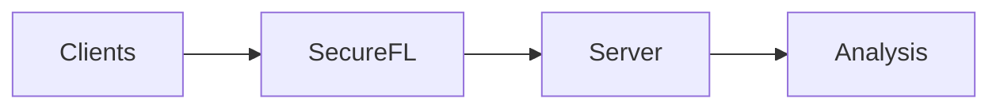
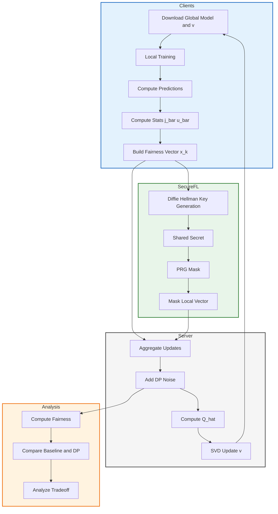

# Secure Federated Learning
This Work extends federated learning with fairness-aware optimization by integrating secure FL into the Rényi-based framework.

Clients train models locally and compute fairness-related statistics. These updates are protected through secure FL layer using key-sharing mechanisms, ensuring that individual client contributions remain hidden. The server then aggregates the masked updates, and updates a global fairness vector.

This design enables a unified analysis of privacy, security, and fairness tradeoffs in federated learning.

## Full Pipeline

<b>Click to expand full system flow</b>

 

## Key Idea

* Clients train locally without sharing raw data
* Secure aggregation hides individual updates
* Fairness without compromised is analyzed across clients

## Functioning And Methodology

## 📊 Results and Analysis

Each client computes a local fairness vector containing statistics such as ( j_{c,p} ) and ( u_c ). Before sending this to the server, the vector is masked using values generated from shared cryptographic keys. For example, a value like ( x_k = 183475 ) is transformed into ( y_k = 183475 + 4294660347 = 4294843822 ), making it appear random to the server. Importantly, these masks are constructed so that they cancel out across clients. As a result, when the server aggregates all received values, the masks sum to zero and the true global sum is recovered.

This is confirmed in the aggregation results, where the difference between the baseline (no masking) and secure aggregation is on the order of ( 10^{-6} ), which is negligible and only due to floating-point precision. This demonstrates that secure aggregation preserves correctness while ensuring privacy.

From the aggregated statistics, fairness is computed using the difference in prediction rates across sensitive groups:
( DEO = |P(\hat{y}=1|s=0) - P(\hat{y}=1|s=1)| ), and ( FR = 1 - DEO ).
The final results show an accuracy of 0.8388 and fairness of 0.7622, with a harmonic mean of 0.7987, indicating a strong balance between performance and fairness. Overall, the system successfully ensures that individual client data remains hidden while still enabling accurate and fair global learning.

### 🎯 Key Insights

* Secure aggregation preserves correctness while ensuring privacy
* Individual client contributions remain hidden
* Fairness metrics can still be computed accurately
* Enables joint analysis of:

  * security (masking)
  * privacy (DP)
  * fairness (Rényi framework)

---

## Note

Dataset is not included due to size. Please place it manually in the `dataset/` folder.
