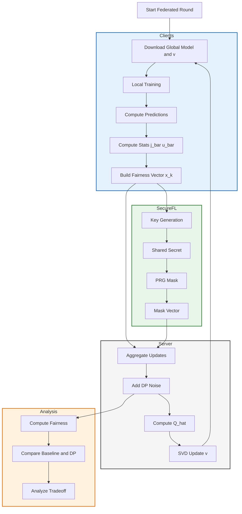

```mermaid
graph TD

%% ================= OVERVIEW =================
START[Start Federated Round]

%% ================= CLIENT SIDE =================
subgraph Clients
    C1[Download Global Model and v]
    C2[Local Training]
    C3[Compute Predictions]
    C4[Compute Stats j_bar u_bar]
    C5[Build Fairness Vector x_k]
end

%% ================= SECURE LAYER =================
subgraph SecureFL
    S1[Key Generation]
    S2[Shared Secret]
    S3[PRG Mask]
    S4[Mask Vector]
end

%% ================= SERVER =================
subgraph Server
    SV1[Aggregate Updates]
    SV2[Add DP Noise]
    SV3[Compute Q_hat]
    SV4[SVD Update v]
end

%% ================= ANALYSIS =================
subgraph Analysis
    A1[Compute Fairness]
    A2[Compare Baseline and DP]
    A3[Analyze Tradeoff]
end

%% ================= FLOW =================
START --> C1 --> C2 --> C3 --> C4 --> C5

%% baseline path
C5 --> SV1

%% secure path
C5 --> S1 --> S2 --> S3 --> S4 --> SV1

%% server flow
SV1 --> SV2 --> SV3 --> SV4

%% feedback loop
SV4 --> C1

%% analysis branch
SV2 --> A1 --> A2 --> A3

%% ================= STYLING =================
style Clients fill:#e3f2fd,stroke:#1565c0,stroke-width:2px
style SecureFL fill:#e8f5e9,stroke:#2e7d32,stroke-width:2px
style Server fill:#f5f5f5,stroke:#424242,stroke-width:2px
style Analysis fill:#fff3e0,stroke:#ef6c00,stroke-width:2px
```
