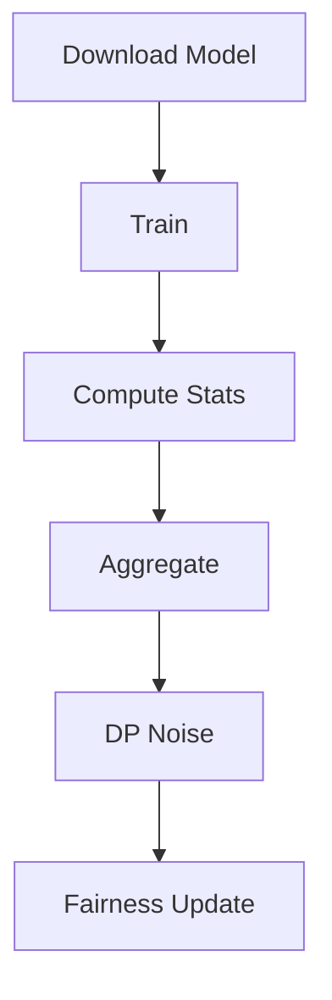

🔍 View System Pipeline Diagram

```mermaid
graph TD
    C1[Download Model] --> C2[Train]
    C2 --> C3[Compute Stats]
    C3 --> SV1[Aggregate]
    SV1 --> SV2[DP Noise]
    SV2 --> SV3[Fairness Update]
```

