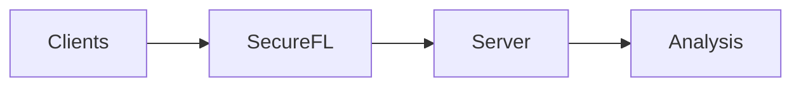
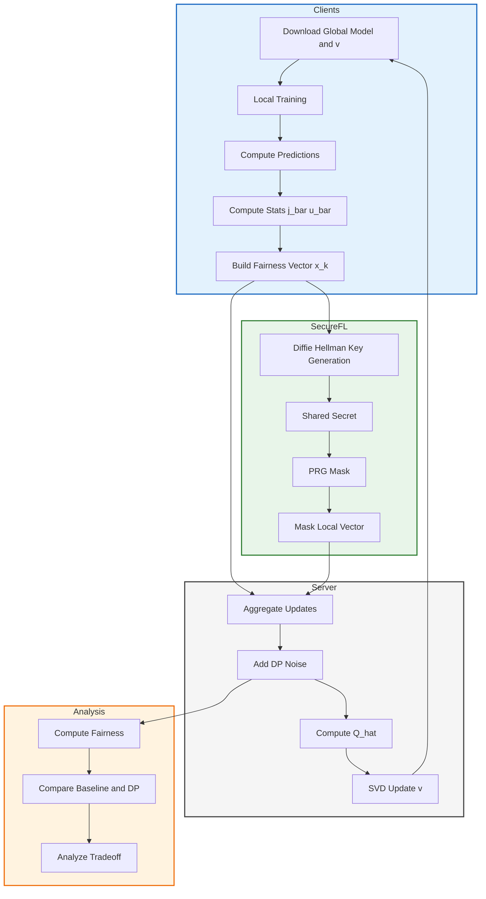

# Secure Federated Learning
This Work extends federated learning with fairness-aware optimization by integrating secure FL into the Rényi-based framework.

Clients train models locally and compute fairness-related statistics. These updates are protected through secure FL layer using key-sharing mechanisms, ensuring that individual client contributions remain hidden. The server then aggregates the masked updates, and updates a global fairness vector.

This design enables a unified analysis of privacy, security, and fairness tradeoffs in federated learning.

## Full Pipeline

<b>Click to expand full system flow</b>

 

## Key Idea

* Clients train locally without sharing raw data
* Secure aggregation hides individual updates
* Fairness without compromised is analyzed across clients

## Functioning And Methodology
Each client computes a local fairness vector containing statistics such as ( j_{c,p} ) and ( u_c ). Before sending this to the server, the vector is masked using values generated from shared cryptographic keys. For example, a value like ( x_k = 183475 ) is transformed into ( y_k = 183475 + 4294660347 = 4294843822 ), making it appear random to the server. Importantly, these masks are constructed so that they cancel out across clients. As a result, when the server aggregates all received values, the masks sum to zero and the true global sum is recovered.

This is confirmed in the aggregation results, where the difference between the baseline (no masking) and secure aggregation is on the order of ( 10^{-6} ), which is negligible and only due to floating-point precision. This demonstrates that secure aggregation preserves correctness while ensuring privacy.

From the aggregated statistics, fairness is computed using the difference in prediction rates across sensitive groups:
DEO = |P(ŷ = 1 | s = 0) - P(ŷ = 1 | s = 1)| and FR = 1 − DEO.

## Results

### Aggregation Correctness (Round 2)

| Dimension | Baseline | Secure   | Difference |
| --------- | -------- | -------- | ---------- |
| 0         | 0.553152 | 0.553151 | 1.19e-06   |
| 1         | 0.425367 | 0.425366 | 9.23e-07   |
| 2         | 0.046829 | 0.046828 | 1.40e-06   |
| 3         | 0.174615 | 0.174613 | 1.64e-06   |
| 4         | 0.467645 | 0.467644 | 1.37e-06   |
| 5         | 0.132336 | 0.132335 | 1.22e-06   |

**Max Difference:** `1.63e-06`

### Aggregation Correctness (Round 1)

| Dimension | Baseline | Secure   | Difference |
| --------- | -------- | -------- | ---------- |
| 0         | 0.524712 | 0.524711 | 1.31e-06   |
| 1         | 0.411902 | 0.411901 | 1.40e-06   |
| 2         | 0.075300 | 0.075299 | 9.46e-07   |
| 3         | 0.188110 | 0.188108 | 1.90e-06   |
| 4         | 0.449003 | 0.449002 | 1.40e-06   |
| 5         | 0.151009 | 0.151007 | 1.88e-06   |

**Max Difference:** `1.90e-06`

### Final Performance

| Model    | Accuracy | Fairness | HM     |
| -------- | -------- | -------- | ------ |
| FedRenyi | 0.8388   | 0.7622   | 0.7987 |

### Summary

* Secure aggregation matches the baseline with differences on the order of `1e-06`
* These small differences are due to floating-point precision
* This confirms that masking cancels out correctly and aggregation remains accurate
* The system preserves both correctness and privacy while enabling fairness evaluation

### What the Numbers Show (with Math)

Each client sends a masked value:

y_k = x_k + mask  (mod M)

Example from the logs:

* x_k = 183475
* mask = 4294660347
* y_k = 183475 + 4294660347 = 4294843822

This makes the transmitted value look random.

---

### Why Aggregation Still Works

At the server:

Sum(y_k) = Sum(x_k + mask_k)
= Sum(x_k) + Sum(mask_k)

Masks are constructed in pairs so that:

Sum(mask_k) = 0

Therefore:

Sum(y_k) = Sum(x_k)

👉 The server recovers the exact global sum without seeing individual values.

---

### Numerical Verification

From the results:

Baseline = 0.553152
Secure   = 0.553151

Difference:

|0.553152 - 0.553151| = 0.000001 ≈ 1e-06

This is extremely small and comes from floating-point precision, not from the algorithm.

---

### Fairness Computation

Fairness is computed as:

DEO = |P(y_hat = 1 | s = 0) - P(y_hat = 1 | s = 1)|
FR  = 1 - DEO

Where probabilities are derived from aggregated counts:

P(y_hat = 1 | s = 1) = j_c1_p1 / (j_c1_p1 + j_c0_p1)
P(y_hat = 1 | s = 0) = j_c1_p0 / (j_c1_p0 + j_c0_p0)

---

### What the Numbers Show

Each client computes its local values and then adds a large mask before sending anything to the server. For example, a value like 183475 becomes:

183475 + 4294660347 = 4294843822

So what the server receives looks completely random and does not reveal the original data.

The important part is how these masks are designed. Across clients, the masks cancel each other out. So when the server adds everything together:

Sum(y_k) = Sum(x_k + mask_k) = Sum(x_k)

This means the server still gets the correct global result, even though it never sees any individual values.

You can see this in the results. For example:

Baseline = 0.553152
Secure   = 0.553151

The difference is about 0.000001 (1e-6), which is extremely small and only due to floating point precision. In practice, the secure result is the same as the baseline.

Fairness is then computed from these aggregated values by comparing prediction rates across groups:

DEO = |P(y_hat = 1 | s = 0) - P(y_hat = 1 | s = 1)|
FR  = 1 - DEO

These probabilities are calculated using the aggregated counts (j values), so fairness can still be evaluated even though individual data is never revealed.

Overall, the numbers show that secure aggregation hides client data while still producing correct and reliable results.

----
## Note
The original Fed-Rényi work reports different accuracy then what we see in our results with ADULT dataset. This difference is primarily due to dataset characteristics, as ADULT is known to be imbalanced, which can inflate accuracy and bias it toward majority classes.

It is important to note that our work does not aim to improve predictive performance over the original method. Instead, the focus is on integrating secure aggregation into the Fed-Rényi framework and verifying that it preserves correctness, privacy, and fairness behavior.

The key contribution of this work is therefore the secure handling of client updates and the demonstration that fairness and utility metrics remain consistent under secure aggregation and differential privacy.
