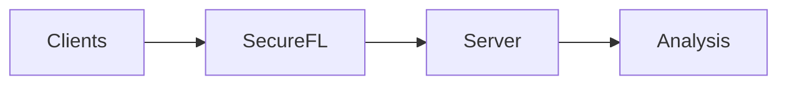
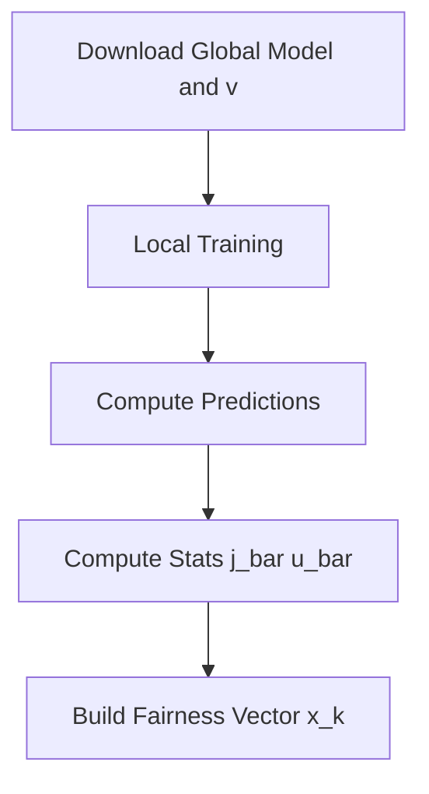
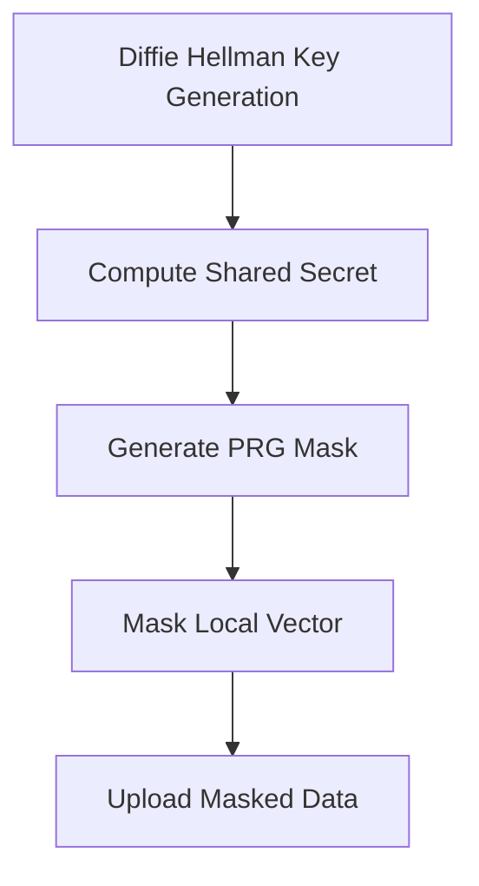
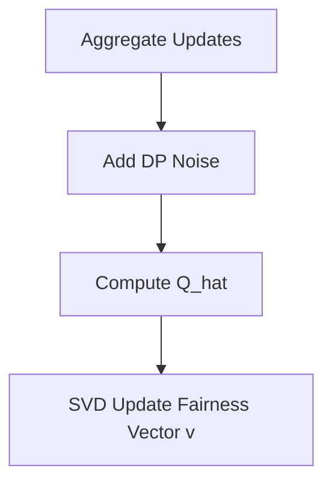
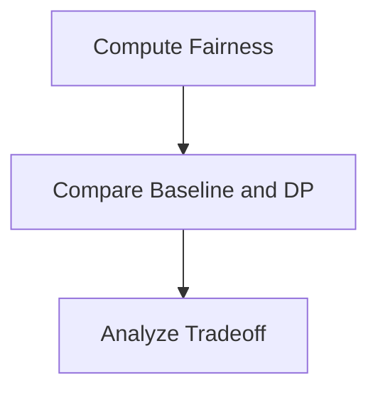
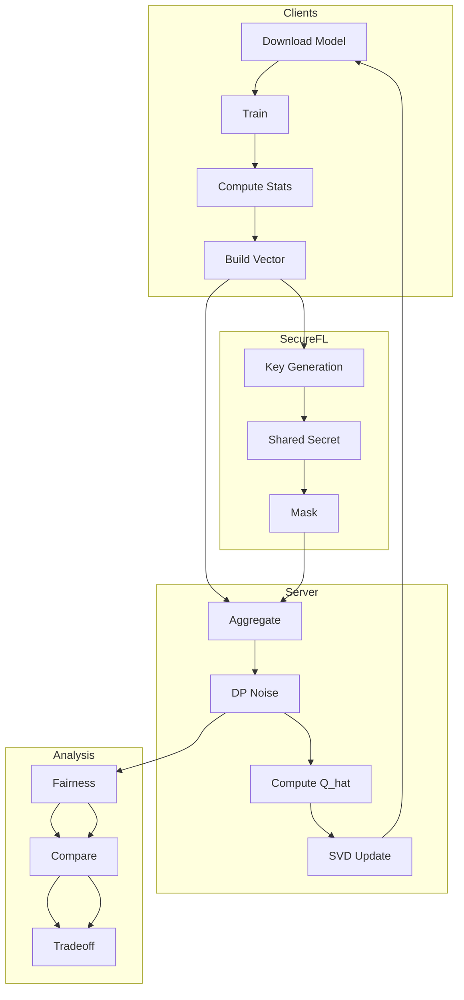

# Federated Learning with Rényi DP and Secure Aggregation

A system-level study of **privacy–utility–fairness tradeoffs** in federated learning using differential privacy and (optional) secure aggregation.

---

## 📊 System Overview



* **Clients**: local training + fairness statistics
* **SecureFL**: key sharing + masking (optional)
* **Server**: aggregation + DP + fairness update
* **Analysis**: fairness vs privacy evaluation

---

## 🔍 Module Details

<details>
<summary><b>Click to explore modules</b></summary>

### 🧠 Clients



### 🔐 SecureFL (Optional)



### 🖥️ Server + DP



### 📊 Analysis



</details>

---

## 🔬 Full System Pipeline

<details>
<summary><b>Click to view full pipeline</b></summary>

<br>



</details>

---

## 💡 Key Idea

* Train models **without sharing raw data**
* Optionally **mask updates** via key sharing
* Add **differential privacy noise** at aggregation
* Evaluate **fairness across clients**

---

## 🧪 Results (Typical Observation)

* Increasing noise → stronger privacy
* But → **fairness gap increases** (especially for smaller clients)
* Highlights a **privacy–fairness tradeoff**

---

## ⚠️ Notes

* Dataset is **not included** due to size
* Place data in `dataset/` before running
* Secure aggregation is **optional** in this implementation

---

## 🚀 How to Run

```bash
python main.py
```

---

## 📁 Project Structure

```
.
├── algorithm/
├── dataset/        # (not included)
├── tool/
├── main.py
└── README.md
```

---

## 📌 Contribution

* Integration of **Rényi DP** in federated learning
* Analysis of **fairness under privacy noise**
* Optional **secure aggregation pipeline**
* Clear **system-level decomposition**

---

## 🧠 Takeaway

> Even small privacy noise can disproportionately affect clients, leading to fairness challenges in federated systems.
