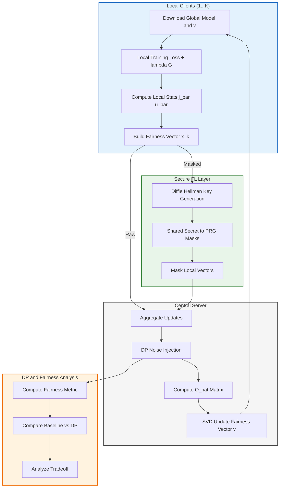

```mermaid
graph TD

%% ================= CLIENT SIDE =================
subgraph Clients ["Local Clients (1...K)"]
    C1[Download Global Model and v]
    C2[Local Training Loss + lambda G]
    C3[Compute Local Stats j_bar u_bar]
    C4[Build Fairness Vector x_k]
end

%% ================= SECURE LAYER =================
subgraph SecureFL ["Secure FL Layer"]
    S1[Diffie Hellman Key Generation]
    S2[Shared Secret to PRG Masks]
    S3[Mask Local Vectors]
end

%% ================= SERVER =================
subgraph Server ["Central Server"]
    SV1[Aggregate Updates]
    SV2[DP Noise Injection]
    SV3[Compute Q_hat Matrix]
    SV4[SVD Update Fairness Vector v]
end

%% ================= ANALYSIS =================
subgraph Analysis ["DP and Fairness Analysis"]
    A1[Compute Fairness Metric]
    A2[Compare Baseline vs DP]
    A3[Analyze Tradeoff]
end

%% ================= FLOW =================
C1 --> C2 --> C3 --> C4

C4 -->|Raw| SV1
C4 -->|Masked| S1
S1 --> S2 --> S3 --> SV1

SV1 --> SV2 --> SV3 --> SV4
SV4 --> C1

SV2 --> A1 --> A2 --> A3

%% ================= CLICK LINKS =================
click C4 "docs/client.md" "View Client Training Details"
click S1 "docs/secure.md" "View Secure Aggregation Details"
click SV2 "docs/flowchart.md" "View DP and Fairness Analysis"

%% ================= STYLING =================
style Clients fill:#e3f2fd,stroke:#1565c0,stroke-width:2px
style SecureFL fill:#e8f5e9,stroke:#2e7d32,stroke-width:2px
style Server fill:#f5f5f5,stroke:#424242,stroke-width:2px
style Analysis fill:#fff3e0,stroke:#ef6c00,stroke-width:2px
```
